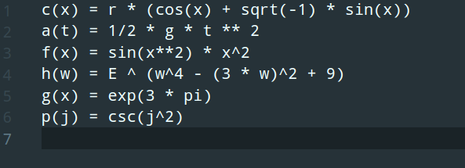
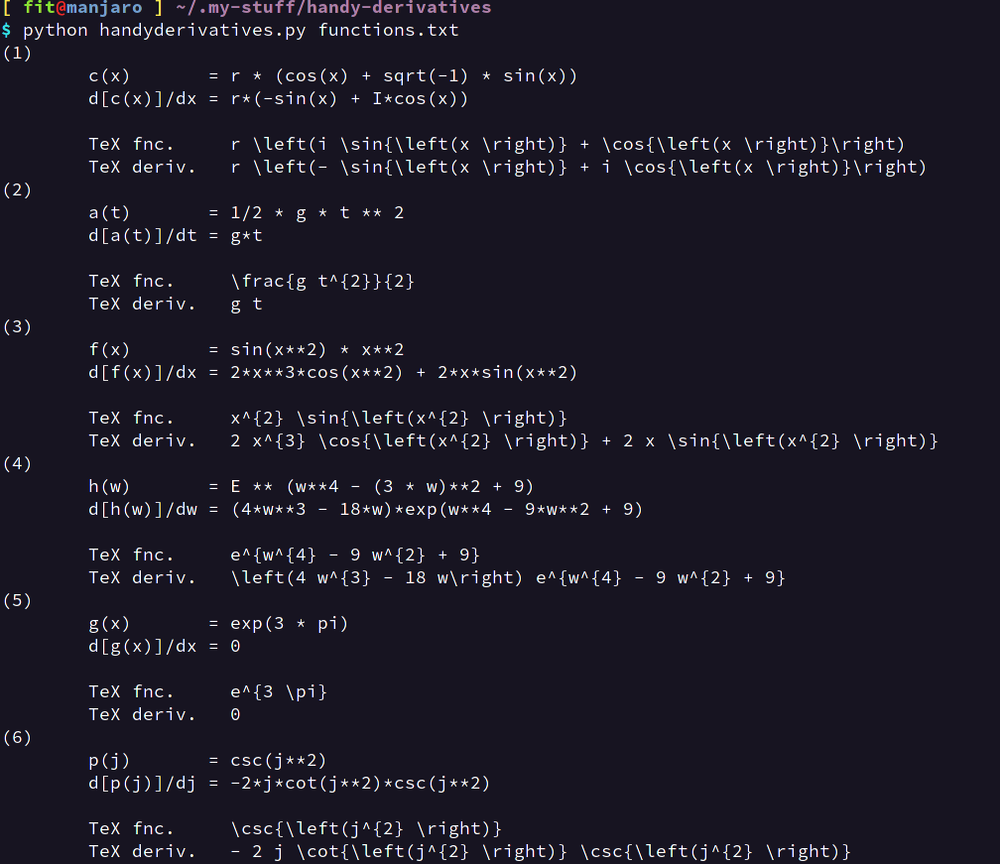

# handyderivatives

Get the derivatives for differentiable functions of a single variable.

Edit a config file that looks like this. 

To get output that looks like this. LaTex output is included.

